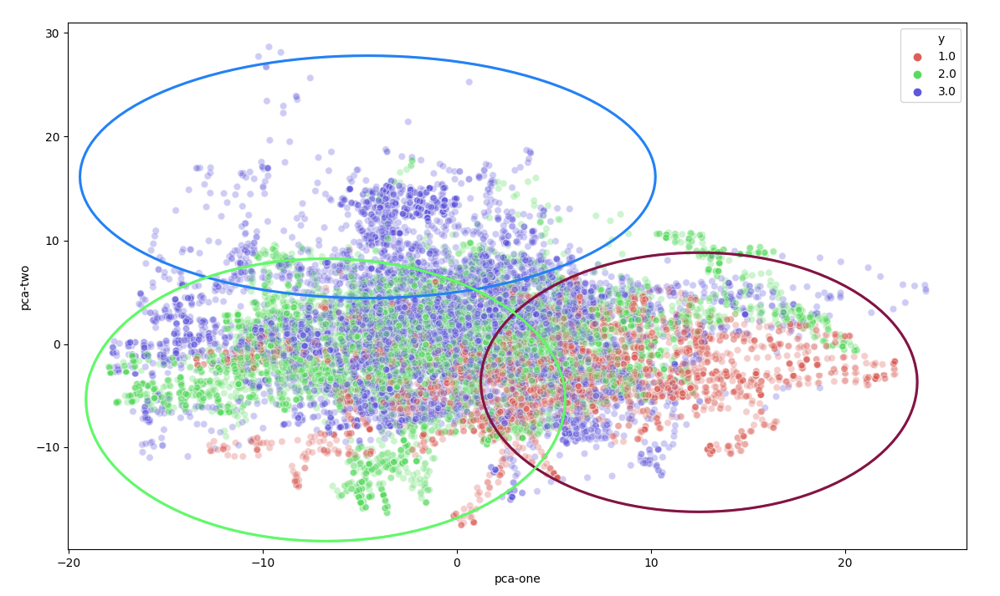

# Applied DataScience - Ortho Eyes
### Cooperation between LUMC Laboratorium of Kinematics en Neuromechanics (LK&N) and The Hague University of Applied Sciences. 


| # | Chapter | Paragraph | Description |
| --- | --- | --- | --- |
| 1. | [Research](#1-Research) | 
| 1.1 | | [Previous Groups](#11-Previous-groups) | 
| 1.2 | | [Project Management](#12-Project-Management) | 
| 2. | [Data-set](#2-Data-set) | 
| 3. | [Visualisation](#3-Visualisation) | 
| 3.1 | | [Visualising raw data](#31-Visualising-raw-data) |
| 3.2 | | [Visualising converted data as 2D](#32-Visualising-converted-data-as-2D) |
| 3.3 | | [t-SNE](#33-t-SNE) |
| 3.4 | | [Combining raw + converted data](#34-Combining-raw-+-converted-data) | 
| 4. | [Converting data](#4-Converting-data) | 
| 4.1 | | [Combining exercises](#41-Combining-exercises) |
| 4.2 | | [Extracting more exercises](#42-Extracting-more-exercises) |
| 4.3 | | [Occupied euler space](#43-Occupied-euler-space) |
| 4.4 | | [ Images (pictures) from data ](#44-Images-(pictures)-from-data) |
| 5. | [Machine Learning](#5-Machine-Learning) | 
| 6. | [Coding-Framework](#6-Coding-Framework) | 
| 7. | [Scrum Tasks](#7-Scrum-Tasks) | 
| 8. | [Neural Networks](#8-Neural-Networks) | 
| 9. | [Personal Development](#9-Personal-Development) | 
| 10. | [Presentations](#10-Presentations) | 
| 11. | [Wordlist](#11-Wordlist) | 
| 12. | [Failed Attempts](#12-Failed-Attempts) | 
| 13. | [Feature of the project](#13-Feature-of-the-project) | 
| 14. | [Git Commits](#14-Git-Commits) | | A list of all git commits created by me (including url's)
| 14. | [Reflection](#15-Reflection) | 
 
# 1. Research
We are doing research for the LUMC in a collaboration with the Laboratory of Kinematics and Neuromechanics (LK&N). The LUMC has requested known patient for muscle torment for a special medical recording to the hospital. The patients are pre-selected by specialized physicians in different levels of torment. Every patient was seated into a special recording room where a physician attached multiple sensors from the Flock of Birds (FOB) recording system on bones of the patient. The patient did multiple types of exercises in most cases multiple times. 

This leaves us with a data-set of labeled patient recordings. The labels are created an put on the data by the LUMC physicians and based upon the type of exercise and the amount of torment in the muscles. 

Our research is about using machine learning techniques to classify feature patients based on the previous classification of the LUMC physicians. 

Research question: 
> **To what extend and in what way, can different (unsupervised) data science techniques be used on kinematic recordings to contribute to a more valid and more reliable diagnosis, made by a doctor, on shoulder disability.**

```
Result from last year, based on allot of assumptions
We tried to encrease teh quality of the data
The result of the logistics regression did get better or worse 

Conclusion about of facts, not assumptions (dataset)

**result** model is worse because of:
- not enough data
- previous group had to many assumptions 

- Verify results by creating a visualistion of the model learning process. 
```

# 1.1 Previous groups 
The previous research group that took an interest in this subject has done allot of work to get us started quickly. [https://github.com/Lukelumia/Applied-Data-Science]. They mainly did research to determent what type of machine learning model would fit the dataset produced by the LUMC the best. They created a way to visualize the data and figure out what parts of the exercise are possibly leading to worse classification of the data. They also created an approach to increase the dataset. 

After reading their full reports the 19/20 project group had some doubts about certain assumptions the group made. Based on this information we contacted the LUMC for clarification. This led to the LUMC sharing more labels on our dataset in order to take the doubts / possible assumptions from the previous group away. 

# 1.2 Project Management
For our research we had to use SCRUMM. This approach is not commonly used for research projects. However in our project group it worked good. After a few weeks reading / understanding the work of the previous group we were able sub questions (issues) building up to a main question. Each issue was built upon multiple tasks that were shared over the project group. All of this was implemented in Azure Dev Ops.  

# 2. Data-set
Physicians requested patients back in 4 groups. 
Each patient was requested to do multiple exercises: 

| Short | Description |
| --- | --- |
| AB[nr.] | Abduction |
| AF[nr.] | Anteflexion |
| RF[nr.] | Retroflexion |
| EH[nr.] | Endo/Exorotation coronal |
| EL[nr.] | Endo/Exorotation humerus |

Every recording was done with the FoB (Flock of Birds) system. 


This system uses sensors attached to the skin of a patient to record the exact location of a bone using electromagnetic fields. For each recording moment of a single sensor the FoB system stores a 3D matrix with the 3D position relative to the ‘black box’ that creates the electromagnetic fields. This 3D position is saved in plain text as a euler angle / rotation matrix. 

_AB1.txt_
```
    2  857.25  -41.08 574.18    // sensorid | x y z
         0.84   -0.54   0.01    // euler rotation matrix
         0.54    0.84   0.06    // euler rotation matrix
        -0.04   -0.04   1.00    // euler rotation matrix
```  

The LUMC created a script that was able to determent the exact position of a bone based upon the sensor location placed on the skin of a patient. 

The ‘raw data’ contains the position in a 3D space for a single bone. This could not be used 1:1 for machine learning. Different examples of why this could be an issue are: 
- Length of limbs could be read by the machine learning model.
- No certainty that every recording environment produces the same 3D space.  

To tackle these issues the LUMC implemented the script to calculate the rotation angle between bones. This would mean movements would be preserved, but the recording environment / bone lengths do not have influence anymore. 

The limbs of a human body are mirrored. So we use the same latin names for each bone and define the side by adding it into the name ```_l_``` or ```_r_```. Each bone is represented by 3 axis to define its rotation in space defined as euler angles. This data is stored as a simple .csv file format. Values are represented as floating point values. 

_Thorax is mirrored (data represented a single sensor)._
_Bones recored by FoB:_
- thorax
- clavicula
- scapula
- humerus
- elbowangle


_example patient exercise format (.csv):_
```
   thorax_r_x_ext  thorax_r_y_ax  thorax_r_z_lat  clavicula_r_y_pro  clavicula_r_z_ele  ...  humerus_l_z_ele  humerus_l_y_ax  elbowangle_l  28  29
0        6.485206      -4.220661       -1.233433          -15.00546           10.47724  ...         14.79337        46.02733        399.8214   0   0
1        6.485206      -4.220661       -1.233433          -15.44328           10.46473  ...         14.77317        45.71592        399.3666   0   0
2        6.485206      -4.220661       -1.233433          -15.42001           10.48047  ...         14.76965        45.32890        399.4807   0   0
3        6.485206      -4.220661       -1.233433          -15.54270           10.43327  ...         14.86782        45.30117        399.7175   0   0
4        6.485206      -4.220661       -1.233433          -15.49114           10.93031  ...         15.45898        34.02906        391.7332   0   0
```

As being said we have 4 patient groups. Each patient did multiple exercises. The following folder structure is used through the whole project: 

_Project file tree, summarized :_
```
.
├── Category_1
│   ├── 1
│   │   ├── AB1.csv
│   │   ├── AB1.txt
│   │   ├── AB2.csv
│   │   ├── AB2.txt
│   │   ├── AF1.csv
│   │   ├── AF1.txt
│   │   ├── AF2.csv
│   │   ├── AF2.txt
│   │   └── ...
│   ├── 2
│   │   ├── AB1.csv
│   │   ├── AB1.txt
│   │   ├── AB2.csv
│   │   ├── AB2.txt
│   │   ├── AF1.csv
│   │   ├── AF1.txt
│   │   ├── AF2.csv
│   │   ├── AF2.txt
│   │   └── ...
│   └── ...
├── Category_2
│   ├── 1
│   │   ├── AB1.csv
│   │   ├── AB1.txt
│   │   └── ...
│   └── ...
├── Category_3
│   ├── 1
│   │   ├── AB1.csv
│   │   ├── AB1.txt
│   │   └── ...
│   └── ...
├── Category_4
│   ├── 1
│   │   ├── AB1.csv
│   │   ├── AB1.txt
│   │   └── ...
│   └── ...
```

Throughout the project reading the dataset very pretty easy. Using pandas we were able to load in the csv with `.read_csv()`. We attached numbers to the columns in order to replace those with the representing bone name.

```python
import pandas as pd
columns = {
        0: "thorax_r_x_ext", 1: "thorax_r_y_ax", 2: "thorax_r_z_lat",
        3: "clavicula_r_y_pro", 4: "clavicula_r_z_ele", 5: "clavicula_r_x_ax",
        6: "scapula_r_y_pro", 7: "scapula_r_z_lat", 8: "scapula_r_x_tilt",
        9: "humerus_r_y_plane", 10: "humerus_r_z_ele", 11: "humerus_r_y_ax",
        12: "ellebooghoek_r",
        15: "thorax_l_x_ext", 16: "thorax_l_y_ax", 17: "thorax_l_z_lat",
        18: "clavicula_l_y_pro", 19: "clavicula_l_z_ele", 20: "clavicula_l_x_ax",
        21: "scapula_l_y_pro", 22: "scapula_l_z_lat", 23: "scapula_l_x_tilt",
        24: "humerus_l_y_plane", 25: "humerus_l_z_ele", 26: "humerus_l_y_ax",
        27: "ellebooghoek_l"
    }
df = pd.read_csv(".../Category_1/1/AF1.csv", names=list(range(30))
df = df.rename(columns=columns)
```

```
TODO: ## new data-set
- Matlab
    - raw + calibration
    - extracting to csv 
    - woo angle system changed to lumc standards 
    - No changes in rotating when a sensor is switched
- Exercise groups are known
- Combining exercises based on labels instead of assumptions
```

# 3. Visualisation
For the project group it was the first few weeks hard to understand what data we could work with. In order to get insights into the data for our own understanding, as for the verification / data cleaning I created multiple scripts that were able to read the data an visualize it in different ways. 


# 3.1 Visualising raw data


The FoB system has multiple receivers who on their own time write the position of a sensor to a text file. In order to visualize this data i first had to split each sensor recording, and read its ID (first value). For all sensors i created a large dictionary with keys for each sensor, and storing all recordings of the sensor in a large list. -> `unpack_values()`

```
9  1267.57  -278.16  471.93  
      0.37     0.92    0.14  
      0.12    -0.19    0.97  
      0.92    -0.35   -0.18  

2  857.25  -41.08  574.18  
     0.84   -0.54    0.01  
     0.54    0.84    0.06  
    -0.04   -0.04    1.00  

3  1259.53  -17.86  35.27  
     -0.58    0.19  -0.80  
     -0.16   -0.98  -0.11  
     -0.80    0.06   0.59  
```

Each recording has 3 parameters i want to use in the visualisation: `X Y Z`. For each FoB recording the sensors were not outputted in a static order. Because of this i recreated the timeline `generate_timeline()`. 
1. **Extracting the sensor data**: From each sensor recording i retreived the first row. Splitted this into 4 chunks, and stored the values as a `NumPy` array with type `Float64`. 
2. **Looping through all sensor recordings**: and storing the float values in a dictionary with the key based on the sensor id. This groups all recordings of each sensor in a list ordered on moment of recording. 
3. **Generating timeline**: The animation function requires to draw single frames. Because of this i choose to generate a timeline from the data in a different format. The `generate_timeline()` creates a list of dictionary's in order of time. Every dictionary contains the `X Y Z` for each of the sensors. 
4. **Working with matplotlib animations**: The matplotlib `FuncAnimation()` requires a list of things to work: 
    - Figure to draw the animation
    - Function that updates the frame
    - Init function   
    - Total count of frames
    - Interval

    The init function initalises the variables used for the animation. 
    The function that updates the frames receives a frame index from the `FuncAnimation()` witch i used to get the correct sensor recordings from the timeline generated before. 

5. **Creating a skeleton**: While attempting to draw a single frame i could add some plots with the sensor index, with this information i was able to create a skeleton (lines between the bones) to form a body shape. 


6. **Animating**: My first attempt was to recreate each point in the dataset for every frame drawn in the animation. This resulted to be very slow. This is why i updated the values for each plot/line with the matplotlib `set_data()` and `set_3d_properties()` functions. 

```Python
# Updating locations of points and their labels
for index, enum in enumerate(zip(self.points, self.texts)):
    point, text = enum  
    point.set_data(x[index], y[index])
    point.set_3d_properties(z[index]) 
    text._position3d = [x[index] * 1.10, y[index], z[index]]
    text._text = str(label[index] - 2)

# Updating location of lines between points
for index, line in enumerate(self.lines):
    start_index, end_index = VisualiseRaw.stick_bones[index]
    xdata = [x[start_index], x[end_index]]
    ydata = [y[start_index], y[end_index]]
    zdata = [z[start_index], z[end_index]]
    line.set_data(xdata, ydata)
    line.set_3d_properties(zdata)
```

7. **Beautifying the animation**: In order to get some more detail from the animation i added trajectory lines to each of the bones. After each frame the trajectory point that is plotted is reduced in size what leads to a nice animation. The last object in the list is redrawn into a new trajectory point to save memory. To get a better understanding about the elbow angle i added this too as value in the visualization and added colors / legend. 

```python
# Updating trajectory points
# Last used point is updated with lastest coordinates 
for index, trajectory_list in enumerate(self.trajectory_points): 
    trajectory_list[self.current_trajectory].set_data(x[index], y[index])
    trajectory_list[self.current_trajectory].set_3d_properties(z[index])
    trajectory_list[self.current_trajectory]._color = self.colors[index]
    trajectory_list[self.current_trajectory]._markersize = 6

    # Upon each new frame, decreasing size / color of each trajectory point
    for index, trajectory in enumerate(trajectory_list):
        if index != self.current_trajectory:
            trajectory._color = trajectory._color * 0.85
            trajectory._markersize = trajectory._markersize * 0.9

# Update current_trajectory to last used trajectory point for next frame
if self.current_trajectory == len(self.colors) - 1:
    self.current_trajectory = 0 
else: 
    self.current_trajectory = self.current_trajectory + 1
```


[repository for the first part of the code](https://dev.azure.com/DataScienceMinor/_git/Data%20Science?path=%2F&version=GBRaw-visualisation&_a=contents)


# 3.2 Visualising converted data as 2D 
# 3.3 t-SNE

Our data-set is so large, and has so many features that it was not possible to visualise the different catagory's in one visualisation that is still readable.
For this case i created a t-SNE visualisation on our data-set based on a [tutorial](https://towardsdatascience.com/visualising-high-dimensional-datasets-using-pca-and-t-sne-in-python-8ef87e7915b?gi=4059c9d035b8). The tutorial defines a large dataframe where two new columns were added `'y'` and `'label'`. At that moment all the code that was written was mostly object oriented, and focused upon improving memory usage and one time reading of the data. Because of this I had to rewrite a large part of the importing of the full file structure especially for t-SNE. 

[A new branch](https://dev.azure.com/DataScienceMinor/_git/Data%20Science?path=%2F&version=GBt-SNE&_a=contents) was created, where i modified the `patient.py` and `exercise.py` to read a single exercise from a patient. And store this in a single dataframe with all the additional labels / true values. I especially did not choose to load all data in t-SNE so the results would be cleaner and easier to verify. 

Using `sklearn`'s `PCA` module a new representation of the dataset was created. And by adding some configurations the script was able to view the data-set as 2D/3D with or without neighbouring enabled!

_t-SNE AB1 Thorax_


_t-SNE AB1 Thorax left-right_


_t-SNE RF1 Thorax_


Seen from the images is clear that different groups are present in the data. There are some outliners in a couple catagory's but nothing special. At the moment of creating these images there was not much data-cleaning done (for example removing double exercises and detecting anomolies.)

Also catagory 4 is missing from the dataset in the visualisations. Known was that the recordings from catagory 4 were not converted from raw to euler rotations correctly. This was clearly visible on the following visualisation. 

_t-SNE AB1 catagory 4_


The small center in the middle is a zoomed out version of the first two images. We expected the data from catagory 4 to be somewhat comparable to catagory 1-3 but this result shows otherwise. Based upon this visualisation the project group choose to ignore this data until verification that the data is correct.

 
# 3.4 Combining raw + converted data

One of the ideas that was always present is to combine the information from rawdata with the converted data. The converded data was only readable by visualsing the plots. However this was hard for us to understand. With the data from the LUMC we were able to combine these two data-sets in one visualisation. With a group partner i have attempted to read both raw / converted values into a matplotlib visualisation to get the best understanding of the data-set that we have. 


# 4. Converting data

We were required to convert the data we received from the LUMC into a new dataset. From the previous group we knew that we should use logistic regression. This gave us a few problems creating a input dataset. 

- Large variation in amount of recorded exercises (per patient)
- Large variation in amount of exercise types (per patient)
- Exercises have different recording length (sample count)

We had to create our own implementation of this data-set in order to get it working with logistic regression. The implementation also had to be reliable, and keep as much original data. 

From this point on we as a project group started to create data-enrichment methods to get the most out of our data set. 

```
The data set that we received from the LUMC was not large in volume, but large in folders and structure. We also had allot of variation / repetition in the amount of recordings and the type of exercise. The research from the previous group pointed us to using logistic regression. Since our data-set did not have a static length, static amount of exercise recordings, static amount of exercise types for each of the patients we had to create our own interpretation for a logistic regression compatable dataset. 

At the same time did we not want to 
```

# 4.1 Combining exercises

Patient data is devided in 5 main exercises (table 1). Physician’s recorded one or more exercises each category from a single patient. 

| Short | Description | Recording 1 | Recording 2 |
| --- | --- | --- | --- |
| AB[nr.] | Abduction | _AB1_ | __AB2__ |
| AF[nr.] | Anteflexion | _AF1_ | __AF2__ |
| RF[nr.] | Retroflexion |  _EH1_ | __EH2__ |
| EH[nr.] | Endo/Exorotation coronal | _EL1_ | __EL2__ |
| EL[nr.] | Endo/Exorotation humerus | _RF1_ | __RF2__ |

The goal is to train a logistics regression model with a combination of all exercise types.
To do this we have to solve a time / exercise length problem. Exercises when executed by patients almost never have the same length. A logistics regression model expects the same amount of inputs for every entry in the dataset. We solved this by creating a combination of exercises with a fixed length. 

Timing issue 
From each exercise we have picked n frames (smaller than the smallest exercise in the whole dataset). We stepped through the exercise with a step size of exercise-length / n. This simple approach leaves us with a static number of frames for each exercise. 


In the case of an exercise with 10 frames, we can pick 5 frames from the exercise: 10 / 5 = 2. We pick the following frames from the exercise: 

|||&darr;||&darr;||&darr;||&darr;||&darr;|
| --- | --- | --- | --- | --- | --- | --- | --- | --- | --- | --- |
| Frame index:| 1 | __2__ | 3 | __4__ | 5 | __6__ | 7 | __8__ | 9 | __10__ |

_Creating the indexes for a exercise._
```python
def get_frames(self):
    frames = []
    size = self.dataframe_size - 1
    for index in range(1, config.frames_counts + 1):
        frames.append(int((size / config.frames_counts) * index))
    return frames
```

```python
# Making a small dataframe of 5 rows by multipling the rows with the columns
frames = self.get_frames() 
# filter dataset based on columns and calculated frame indexes 
self.dataframe = self.dataframe[config.columns].iloc[frames]
```

Creating a single patient 
As said above we have 5 exercise types for each patient. We appended these combinations together in order to create a single row in our dataset. 

| [n frames] | [n frames]  | [n frames] | [n frames] | [n frames] |
| --- | --- | --- | --- | --- |
| AB1 | AF1	| EH1 | EL1 | RF1 | 

In order to maximize the training dataset, we used a combination of exercise types from a single patient. 

|Combination # | [n frames] | [n frames]  | [n frames] | [n frames] | [n frames] |
| --- | --- | --- | --- | --- | --- |
|1| AB1 | AF1 | EH1 | EL1 | RF1 |
|2| __AB2__ | AF1 | EH1 | EL1 | RF1 | 
|3| AB1 | __AF2__ | EH1 | EL1 | RF1 | 
|4| AB1 | AF1 | __EH2__ | EL1 | RF1 |
|5| AB1 | AF1 | EH1 | __EL2__ | RF1 |
|6| AB1 | AF1 | EH1 | EL1 | __RF2__ |


In the case of 5 frames per exercise, 5 exercise types per patient, 26 features per exercise = 650 features for a single patient exercise combination. 

The a mount of combinations for a single patient =  
[n AB recordings] · [n AF recordings] · [n EH recordings] · [n EL recordings] · [n RF recordings]


In order to implement this we had to reform the data into a dictionary which is sorted by exercise group for every individual patient in the dataset. 
```python
{
    "AB": [<list of exercises>],
    "AF": [<list of exercises>],
    "EH": [<list of exercises>],
    "EL": [<list of exercises>],
    "RF": [<list of exercises>]
}
```
_Creating the dictionary_
```python
patient_data = {}
for name in Exercise.names: # contains list AB, AF, EH, etc..
    # creating empty array for each of the exercise keys
    patient_data[name] = []

# Looping through all exercises of a patient
for exercise in patient.exercises:
    # Appending the exercise into the list of key
    patient_data[exercise.name].append(exercise)

# returning a list of every single combination possible between the exercise types using itertools.product. 
return list(itertools.product(patient_data['AF'], 
                              patient_data['EL'], 
                              patient_data['AB'], 
                              patient_data['RF'], 
                              patient_data['EH']))
```

Looping through all individual patients from each patient group. I append the result from the function above to a list `self.data` and contains the result of `itertools.product()` for each of the patients. 

```python
import numpy as np 
# array holding all data
np_combination_array = np.empty((0, len(self.config.columns) *
                                    self.config.frames_counts * self.config.exercise_count))

# Looping through all patient combinations
for exercise_combination in self.data:
    # Creating an empty array for a single combination 
    data = np.array([])
    for exercise in exercise_combination:
        # Getting 5 frames from exercise
        exercise_flat = exercise.np_data.reshape(1, len(self.config.columns) * self.config.frames_counts)
        data = np.append(data, exercise_flat[0])
    # adding the combination to the main data array 
    np_combination_array = np.vstack([np_combination_array, data])
```


# 4.2 Extracting more exercises
In the case of an exercise with 10 frames, we can pick 5 frames from the exercise: 10 / 2 = 5. We pick the following frames from the exercise: 

||||||&darr;|||||&darr;|
| --- | --- | --- | --- | --- | --- | --- | --- | --- | --- | --- |
| Frame index: | 1 | 2 | 3 | 4 | __5__ | 6 | 7 | 8 | 9 | __10__ |

However this would leave us with unused parts of the exercise. In order to still use all the data for training we created a new method that looks before and after the selected frame (if possible) and extracts these as a new formatted exercise. In the example case its only possible to look before values, this leaves us with two exercise extractions: 

|||||__&darr;__|&darr;||||__&darr;__|&darr;|
| --- | --- | --- | --- | --- | --- | --- | --- | --- | --- | --- |
| Frame index: | 1 | 2 | 3 | __4__ | _5_ | 6 | 7 | 8 | __9__ | _10_ |

This method would leave us with more data, and we did not use the same data twice. Since the data consists of movements the values almost always fluctuates. 

```python
def gen_frames(self):
    # getting the original frames
    frames = self.get_frames()
    # creating index sum, example: [-1 0 1] | [-2 -1 0 1 2]
    new_frame_table = [-int(config.frame_generator_count/2) + var for var in range(config.frame_generator_count)]
    for frame in new_frame_table:
        new_frames = []    
        # Looping through original frame indexes
        for subframe in frames: 
            new_frame = subframe + frame 
            # checking for out of index on dataset
            if new_frame > len(self) - 1:
                # subtracting to prevent out of index
                new_frame = subframe - frame
            # adding the new index to new_frames
            new_frames.append(new_frame)  
        # getting all the indexes from the dataset
        # appending it to larger array 
        self.np_frames.append(self.df[config.columns].iloc[new_frames].to_numpy())
```

Generating the frames is done on exercise level. Doing this won't affact the relation between the patient group and the patient. This allows us to use the same methology as above. Looping again trough patients to find all combinations between exercises for a single patient. 

```python
patient_data = {}
for name in Exercise.names: # contains list AB, AF, EH, etc..
    # creating empty array for each of the exercise keys
    patient_data[name] = []

# Looping through all exercises of a patient
for exercise in patient.exercises:
    # Appending the exercise into the list of key
    patient_data[exercise.name].append(exercise)

# returning a list of every single combination possible between the exercise types using itertools.product. 
return list(itertools.product(patient_data['AF'], 
                              patient_data['EL'], 
                              patient_data['AB'], 
                              patient_data['RF'], 
                              patient_data['EH']))
```
Looping through all individual patients from each patient group. I append the result from the function above to a list `self.data` and contains the result of `itertools.product()` for each of the patients. 

```python
# creating empty numpy object for an individual patient 
np_combination_array = np.empty((0, len(self.config.columns) * self.config.frames_counts * 5))
# looping through all results 
for exercise_combination in self.data: 
    # Creating empty array's for all sets in the data
    data_array = [np.array([]) for _ in range(len(exercise_combination))]
    # looping through all extending frame groups
    for exercise_id in range(len(exercise_combination)):
        # with example indexes [[4, 5, 6] , [9, 10, 11]].
        # we first add 4, 9, later append 5, 10 to respected list.
        for exercise_frame in exercise_combination[exercise_id].np_frames:
            # forming the frames for a single exercise.
            exercise_flat = exercise_frame.reshape(1, len(self.config.columns) * self.config.frames_counts)
            # appending to the end of correct row to create array.
            data_array[exercise_id] = np.append(data_array[exercise_id], exercise_flat[0])

    # appending every exercise combination combined with the extra frame rows to the main data array
    for data in data_array:
        np_combination_array = np.vstack([np_combination_array, data])
```

# 4.3 Occupied euler space


# 4.4 Images (pictures) from exercises 

Images are a great way of formatting data. A single pixel could consist out of 3 channels (colors: red, green, blue) with defined values (0 -> 255). Or data-set consists out of sensors placed on a patient. These sensors record in 3 dimentions (x, y, z). A good fit for the 3 channels in an image. 


There are pretrained neural networks based upon recignising patterns in images. Fitting our data into could introduce these pretrained networks for our model. 

To start with I have made a list of bones i want to attach to each row of pixels. For each moment in time a pixel is created with 3 channels. Stacking the pixels next to each other to create a single row. 

| row index | channel 1 | channel 2 | channel 3 |
| --- | --- | --- | --- |
|1| thorax_r_x_ext | thorax_r_y_ax | thorax_r_z_lat | 
|2| clavicula_r_y_pro | clavicula_r_z_ele | clavicula_r_x_ax |
|3| scapula_r_y_pro | scapula_r_z_lat | scapula_r_x_tilt |
|4| humerus_r_y_plane | humerus_r_z_ele | humerus_r_y_ax |
|5| thorax_l_x_ext | thorax_l_y_ax | thorax_l_z_lat |
|6| clavicula_l_y_pro | clavicula_l_z_ele | clavicula_l_x_ax |
|7| scapula_l_y_pro | scapula_l_z_lat | scapula_l_x_tilt |
|8| humerus_l_y_plane | humerus_l_z_ele | humerus_l_y_ax| )

This process results in a bar of 8 pixels. A patient has done 5 exercises, stacking these exercises in a zeroed out array creates the following image

_Patient converted into image, enlarged_ -> [original](images/patientimage1.png)


_Patient converted into image, enlarged_ -> [original](images/patientimage2.png)


For the first image its clear that the last exercise added (lowest bar with color green present) has a much longer lenght than the other exercises. The colors do not appear to change much over time. But looking at the actual pixel values there is much variation in it. This is probably because of image viewers / screen quality fewing a small image of 8 * 5 pixels. 

Creating the image for a single patient. To define the color of the pixel i normalized the values of each bone axis to a value between 0 and 1. 
All values in the exercise recordings are euler angles. By using modulo 360 the values are converted to [0-360]. By deviding these results by 360 we get values between [0-1]. By multiplying these values by 255 we get the  pixel values [0-255].

```python
def image_for_patient(patient):
    # finding the longest exercise for that patient
    max_lenght = 0
    for exercise in patient.exercises:
        if exercise.dataframe_size() > max_lenght:
            max_lenght = exercise.dataframe_size() 

    # creating an empty image (filled with zeros)
    imarray = np.zeros((len(patient.exercises) * 8, max_lenght, 3))
    print('created an empty image with the shape:', imarray.shape)

    exercise_index = 0 
    # looping through all patient's exercises
    for exercise in patient.exercises: 
        # converting euler angles to pixels
        dataframe = exercise.dataframe.mod(360).divide(360).multiply(255)
        print('adding dataframe to image with shape:', dataframe.shape)

        # looping through all bones (see table above)
        for column_index, column in enumerate(columns, exercise_index):
            # looping through all values of the exercise for a single bone
            for row_index in range(exercise.dataframe_size()): 
                # getting the x, y, z bone names 
                x, y, z = column 
                # adding the pixel value to the 3D matrix for 3 channels
                imarray[column_index, row_index, 0] = dataframe[[z]].iloc[row_index]
                imarray[column_index, row_index, 1] = dataframe[[x]].iloc[row_index]
                imarray[column_index, row_index, 2] = dataframe[[y]].iloc[row_index]
        # stepping to the next 8 pixels for the next bone
        exercise_index = exercise_index + len(columns) 

    # converting the array to uint8 for correct png representation 
    imarray = imarray.astype(np.uint8) 
    
    # saving the image with patientid as filename 
    im = Image.fromarray(imarray, mode='RGB')
    im.save('{filename}.png'.format(filename=str(patient)))
```

## adding additional layers to the image 
Most images on the web are based upon 3 channels; red green blue. Additional channels are sometimes used for transparacy or other values. In our case a pretrained neural network can take unlimited amount of channels and still interpretate the values together as a image. This means we can add more information to the image. 

**differentiation** 

Requested from the LUMC is the differentiation between values. In order to keep the differentiation values attached to the representing bone axis we can stack the values in the new channels. 

For each of the bone axis we can calculate the difference between values. This means from one bone we get a difference in x y z. This would result in 3 additional layers


We pass the signal through a lowpass filter in order to get an clean result. Based upon these values we can derive the difference and add this to the pixels the same way as we did above. 

```python
self.filtered_signal = self.lowpassfilter(1/6, 1 / (2 * math.pi * 0.5)) 

def differentiation(self, y,  h=1):
    '''Compute the difference formula for f'(a) with step size h.
        Parameters
        ----------
        f : function
            Vectorized function of one variable
        a : number
            Compute derivative at x = a
        method : string
            Difference formula: 'forward', 'backward' or 'central'
        h : number
            Step size in difference formula
        '''
    differentiation = np.zeros((y.shape))
    for i, value in enumerate(range(y.shape[0] - 1), 1):
        differentiation[i] = (y[i] - y[i-1]) / (1/6)

    return differentiation 

# TODO: Implement function on all bones!! 
def lowpassfilter(self, dt, RC):
    # RC: time constant - related to cut off freq
    # dt: time interval 
    _np_array = np.empty(self.df.shape)

    for i in range(self.df.shape[1]):
        x = self.df.to_numpy()[:,i]  
        y = np.zeros((self.df.shape[0], 1))
        a = dt / (RC + dt)  
        y[0] = x[0] 
        
        for i, value in enumerate(range(x.shape[0] - 1), start=1):    
            y[i] = a * x[i] + (1-a) * y[i-1]

        _np_array = np.hstack((_np_array, y))

    return _np_array
```

```
- Five exercises 
- 5 splits of the data
    - Combining multiple exercises from one patient
    - More than 5 splits
- Combining exercises for patients
- 360 euler space
- Creating images from the data 
```

## Cleaning our data-set
- Removing idle 
- Filtering / Ordering
- Splitting test / train (on patient level)
- Splitting exercises 


# 5. Machine Learning
- Logistic Regression
- SVM 
- Implementing in framework

# 6. Coding Framework

From early in the project I have started working on a Framework for the available dataset. There were many implementations possible for our data-set. In order to create a structure that would be reusable over different iterations I choose for a object orientated model. This would lead to better memory management, and faster implementing new features. 


Because of this structure it was very easy to read all of the information from files into memory. Where is object has its own place in memory. If patients need to be rotated or searched through python would only need the pointer to this place in memory instead of reading the full csv again, or moving around large arrays in memory. 

## Configurations

As explained above there are multiple ways of transforming the data into a shape that is fit for machine learning. To apply these configurations with an efficient method we created a toolbox and a config class.

A config class contains switches for all implementations we have build as a group. There is one general config class for the whole project. However the config could be modified during the lifetime of the program. 

```python
class config(baseconfig):
    remove_idle = False
    resample_exercise = False 
    frame_generator = False 
    occupied_space = False 
    default = True 

    normalise = True

    remove_idle_split_count = 3
    frames_counts = 5
    binsize = 10
    frame_generator_count = 5

    exercisegroups = ['AF', 'EL', 'AB', 'RF', 'EH']
    exercise_count = len(exercisegroups)
```

At the launch of the program, for each patient in every patiengroup the original exercise data is loaded into `Exercise.df`. This dataframe should never been touched and be concidered to be read-only. `Excercise.py` contains a function `update_config()`. This function looks at the current state of the config class and apply's all enabled methods to a new variable `dataframe`. By default this function is called after loading the df variable. 


Where each of the groups could be group together with a reference and not by copying the full data-set in memory. 


- Reading the data-set
- UML 
- Benefits 
- Multi-os support
- Multi-threading
- Memory management
- Configurations
- Configuration loader
- Datalogger
- Statistics
- Visualsing results (tabulate / )
- Configloader – parsing model results (sorting results)

# 7. Scrum Tasks
- Taable here 

# 8. Neural Networks
- Creating an image from our data-set
- Adding a 4th layer
- CNN 

# 9. Personal Development 
- Datacamp
- Lectures
- Udemy 


# 10. Presentations

# 11. Wordlist 

| # | Word | Description |
| --- | --- | --- |
| 1. | FoB (Flock of Birds) | System to record bones of a patient  

# 12. Failed Attempts 
- 

# 13. Feature of the project
- AR 

# 14. Git Commits 

| Commit Hash (clickable) | Date | Branch | Details |
| --- | --- | --- | --- |
[73c9cb1](https://dev.azure.com/DataScienceMinor/Data%20Science/_git/Data%20Science/commit/b7eca6cb4740455d6bec83c034c7b2ced73c9cb1)|2019-12-18T11:58:29+01:00| (HEAD -> master2.0, origin/master2.0, origin/HEAD)|Implementing new configurations, fixing normalisation
[ded5db2](https://dev.azure.com/DataScienceMinor/Data%20Science/_git/Data%20Science/commit/ad39aa052c06bf38637ae833fa1c97757ded5db2)|2019-12-17T16:13:01+01:00||Added normalisation, created new config without columns
[c0b2a06](https://dev.azure.com/DataScienceMinor/Data%20Science/_git/Data%20Science/commit/fda4ae3372097fb98ca4c31af9e5a8182c0b2a06)|2019-12-17T14:46:34+01:00||production on data-clean
[bb7647d](https://dev.azure.com/DataScienceMinor/Data%20Science/_git/Data%20Science/commit/2332a3dddbe16ac8e9a913670ebce3ce9bb7647d)|2019-12-17T14:45:34+01:00||Creating final configuration of all configs!
[1f29e2e](https://dev.azure.com/DataScienceMinor/Data%20Science/_git/Data%20Science/commit/62b7ba36895497d46200e52d87214e59d1f29e2e)|2019-12-17T13:40:26+00:00||Renamed data-clean-2 to data-clean
[e8dc14b](https://dev.azure.com/DataScienceMinor/Data%20Science/_git/Data%20Science/commit/3cb14224e724c74475422810c4ffeb995e8dc14b)|2019-12-17T13:40:20+00:00||Deleted data_clean
[cfc2171](https://dev.azure.com/DataScienceMinor/Data%20Science/_git/Data%20Science/commit/2139ee45e85ed1e04d6e0e4fb386050e1cfc2171)|2019-12-17T14:38:41+01:00||merge
[bfaa5cc](https://dev.azure.com/DataScienceMinor/Data%20Science/_git/Data%20Science/commit/6c537d6200200689711003e7066090b46bfaa5cc)|2019-12-17T14:33:36+01:00||splitted exercises with 3 chunks
[c106e76](https://dev.azure.com/DataScienceMinor/Data%20Science/_git/Data%20Science/commit/da85fe4f56eb0a400f01d55700bfbd625c106e76)|2019-12-17T13:56:59+01:00||Testing the config loader for memory issues
[3e4ee72](https://dev.azure.com/DataScienceMinor/Data%20Science/_git/Data%20Science/commit/1a7493954d65ae06c59e23669fc99bfef3e4ee72)|2019-12-17T13:52:12+01:00||Testing model without processor
[e653828](https://dev.azure.com/DataScienceMinor/Data%20Science/_git/Data%20Science/commit/be2f2b74e93b98e67a06d9d442429ea23e653828)|2019-12-17T13:41:32+01:00||Printing issue
[f584930](https://dev.azure.com/DataScienceMinor/Data%20Science/_git/Data%20Science/commit/d82507ffc6847862f4d8273c3dbb7c3e8f584930)|2019-12-17T13:40:50+01:00||Testing framework without pipeline to detect memory issue
[afc2ad3](https://dev.azure.com/DataScienceMinor/Data%20Science/_git/Data%20Science/commit/973ef81123ff387ca99dd0f5517feacbcafc2ad3)|2019-12-17T13:17:46+01:00||cleaning model memory after run
[b818ca5](https://dev.azure.com/DataScienceMinor/Data%20Science/_git/Data%20Science/commit/266972a50fa847082cd4b2d7a8a219dafb818ca5)|2019-12-17T13:15:25+01:00||Printing pid on startup
[07c3ad1](https://dev.azure.com/DataScienceMinor/Data%20Science/_git/Data%20Science/commit/8f0b42e3b6115e66957e7004876813cfd07c3ad1)|2019-12-17T12:39:47+01:00||Resolved issue with implementation of datamanager
[7862acc](https://dev.azure.com/DataScienceMinor/Data%20Science/_git/Data%20Science/commit/080cdef871650ed1d18d8ecce50d247657862acc)|2019-12-17T12:14:15+01:00||Fixing issue with differentiation printing
[fbc88d3](https://dev.azure.com/DataScienceMinor/Data%20Science/_git/Data%20Science/commit/bad4193082c5590b3a392092b89e797d7fbc88d3)|2019-12-17T12:12:04+01:00||Differentiation for exercises
[ddb343d](https://dev.azure.com/DataScienceMinor/Data%20Science/_git/Data%20Science/commit/a77f06bb3057adacdf6086ddbddeef866ddb343d)|2019-12-16T13:48:21+01:00||Creating an image out of data-set
[bc872fe](https://dev.azure.com/DataScienceMinor/Data%20Science/_git/Data%20Science/commit/b0a6a465d77dd533b1c25c11927ccbe01bc872fe)|2019-12-13T16:57:52+01:00||New data-set / statistics on data
[60a09b1](https://dev.azure.com/DataScienceMinor/Data%20Science/_git/Data%20Science/commit/e720d2eb1c92c7fe50d06c9789c9d8e3c60a09b1)|2019-12-13T12:39:11+01:00| (origin/DataCleaner)|Splitted catagory 3
[494ed46](https://dev.azure.com/DataScienceMinor/Data%20Science/_git/Data%20Science/commit/3a3e9b494533256b194e837c337d4c2cf494ed46)|2019-12-13T12:37:31+01:00||Updating patient split list
[7ef6f52](https://dev.azure.com/DataScienceMinor/Data%20Science/_git/Data%20Science/commit/bdb3d2b5dfb909e5a4049caa6006b6d3a7ef6f52)|2019-12-13T12:35:45+01:00||Splitted catagory 2
[54c2b2f](https://dev.azure.com/DataScienceMinor/Data%20Science/_git/Data%20Science/commit/65dd40205fbaa8fda62bfb633e575a28f54c2b2f)|2019-12-13T12:34:57+01:00||Implemented datacleaner on xlsx, applying to dataset
[90aa053](https://dev.azure.com/DataScienceMinor/Data%20Science/_git/Data%20Science/commit/553cec79db6f1dc5cd0c5b2790cf3caa290aa053)|2019-12-09T13:33:00+01:00||Cleaning code, fixing issues with removal of classes.
[7bf27e2](https://dev.azure.com/DataScienceMinor/Data%20Science/_git/Data%20Science/commit/a5f6a4a782083a1f1ddac2547b7c5f9f57bf27e2)|2019-12-03T13:39:02+01:00||Updating model output
[75711e8](https://dev.azure.com/DataScienceMinor/Data%20Science/_git/Data%20Science/commit/84d1091b0960ec2340ca340dfe39aac7575711e8)|2019-11-29T16:21:08+01:00||Attempt to implement recurrent neural network on our data-set
[67afe54](https://dev.azure.com/DataScienceMinor/Data%20Science/_git/Data%20Science/commit/9baa18267865a2edf3a485c8998c6292967afe54)|2019-11-29T14:53:45+01:00||Model evualution in configcreator
[b947fc1](https://dev.azure.com/DataScienceMinor/Data%20Science/_git/Data%20Science/commit/eb722e92fbc0afaf1a9ff7e18117b29afb947fc1)|2019-11-28T12:31:24+01:00||Merge branch 'master2.0' of ssh.dev.azure.com:v3/DataScienceMinor/Data%20Science/Data%20Science into master2.0
[ac3d245](https://dev.azure.com/DataScienceMinor/Data%20Science/_git/Data%20Science/commit/35a334c86767ff5c8c7e203949bd917c6ac3d245)|2019-11-28T12:31:21+01:00||Merged data manager into branch!
[c1a84ef](https://dev.azure.com/DataScienceMinor/Data%20Science/_git/Data%20Science/commit/2c749840af449a2aea68c32f591a63720c1a84ef)|2019-11-26T15:37:09+01:00||Running neural network on our dataset!
[c42d435](https://dev.azure.com/DataScienceMinor/Data%20Science/_git/Data%20Science/commit/0259fd63c63d111e7ddbdf6b847b709acc42d435)|2019-11-25T12:13:46+01:00||Cleaning repository, creating minimal example
[bca4f4f](https://dev.azure.com/DataScienceMinor/Data%20Science/_git/Data%20Science/commit/96d2afaca7208c0f3dab2fd85a726fe31bca4f4f)|2019-11-22T16:01:00+01:00||Removing some prints
[bdac8e5](https://dev.azure.com/DataScienceMinor/Data%20Science/_git/Data%20Science/commit/5c91893938718fe2cf5986c4579f9870cbdac8e5)|2019-11-22T15:56:09+01:00||Recreated remove idle - some cleaning up
[89fc012](https://dev.azure.com/DataScienceMinor/Data%20Science/_git/Data%20Science/commit/418b468dd7fedb36c3ae51dabd7a4fa4089fc012)|2019-11-20T17:45:54+01:00||Sorting scores, setting default values for remove_idle
[59db052](https://dev.azure.com/DataScienceMinor/Data%20Science/_git/Data%20Science/commit/7a9ec21a5440c71659515b48ad144095359db052)|2019-11-20T15:28:04+01:00||Merge branch 'master2.0' of ssh.dev.azure.com:v3/DataScienceMinor/Data%20Science/Data%20Science into master2.0
[8c13116](https://dev.azure.com/DataScienceMinor/Data%20Science/_git/Data%20Science/commit/42af3d0a5ad6aa42c268d154b2dfed3cc8c13116)|2019-11-20T15:28:00+01:00||Created multiple configurations, small fixes in project
[9d51dd4](https://dev.azure.com/DataScienceMinor/Data%20Science/_git/Data%20Science/commit/d36286179c28376c5e0f05a9a4fb1d8179d51dd4)|2019-11-20T13:09:11+01:00||Configloader and creator to run the model multiple times
[817b24a](https://dev.azure.com/DataScienceMinor/Data%20Science/_git/Data%20Science/commit/eedd991fee1b1bdb910e4dc92241b71d4817b24a)|2019-11-14T16:15:29+01:00| (origin/t-SNE)|Config changes, minor visualisation fixes
[ebf81de](https://dev.azure.com/DataScienceMinor/Data%20Science/_git/Data%20Science/commit/c0ca4ec92439be092758b70ff363661faebf81de)|2019-11-14T15:32:25+01:00||Added Neural Network Model!
[76cd7b3](https://dev.azure.com/DataScienceMinor/Data%20Science/_git/Data%20Science/commit/1e8498fdd72caf0a5d9d705a9fc6a16c176cd7b3)|2019-11-14T13:40:02+01:00||Implemented switch between single thread / multithread loading
[aad5045](https://dev.azure.com/DataScienceMinor/Data%20Science/_git/Data%20Science/commit/4a740493114b30345434394d97d45b07faad5045)|2019-11-14T13:32:59+01:00||freeze_support for windows
[067e374](https://dev.azure.com/DataScienceMinor/Data%20Science/_git/Data%20Science/commit/d4572040d471ee1f6cb6c240c390b5f6d067e374)|2019-11-14T13:30:52+01:00||Implemented multi-threading for patientgroup loading
[e3ed8bc](https://dev.azure.com/DataScienceMinor/Data%20Science/_git/Data%20Science/commit/bacdaf64977a85736112dd639bc811831e3ed8bc)|2019-11-14T12:38:45+01:00||Included tony's resample feature, config cleaning
[cbdb657](https://dev.azure.com/DataScienceMinor/Data%20Science/_git/Data%20Science/commit/7cf839b1dc2e5bbb22c66860af2e90e2acbdb657)|2019-11-14T11:55:19+01:00||t-SNE on tony data
[23ab9ad](https://dev.azure.com/DataScienceMinor/Data%20Science/_git/Data%20Science/commit/5e13b547b2b5b09a348bc7887bb20841f23ab9ad)|2019-11-14T10:44:48+00:00| (origin/b4d9acbb-revert-from-master2.0)|Revert "Merge branch 'master2.0' of ssh.dev.azure.com:v3/DataScienceMinor/Data%20Science/Data%20Science into master2.0"
[a5c6a27](https://dev.azure.com/DataScienceMinor/Data%20Science/_git/Data%20Science/commit/776e38312f65e0fd385d7e28ac01d9060a5c6a27)|2019-11-12T13:59:22+01:00||Implementing the tony method, visualising results with tsne
[5551d35](https://dev.azure.com/DataScienceMinor/Data%20Science/_git/Data%20Science/commit/68475c0149dc8a7974e7b16f9e8d6a4b35551d35)|2019-11-12T12:30:04+01:00| (origin/Anomaly-detection)|Changes
[cd6d3ac](https://dev.azure.com/DataScienceMinor/Data%20Science/_git/Data%20Science/commit/e47676afb21402d92514366599fd43eb1cd6d3ac)|2019-11-11T15:01:10+01:00||Removing idle parts of exercise
[618a30f](https://dev.azure.com/DataScienceMinor/Data%20Science/_git/Data%20Science/commit/8399c93f9e0e8be3fcbb909440d14b07b618a30f)|2019-11-11T12:58:35+01:00||Merge branch 'master2.0' of ssh.dev.azure.com:v3/DataScienceMinor/Data%20Science/Data%20Science into master2.0
[d2a8aeb](https://dev.azure.com/DataScienceMinor/Data%20Science/_git/Data%20Science/commit/2eb7605c5fc681d804a52c00840ad0426d2a8aeb)|2019-11-11T12:58:33+01:00||Fixed sensor order, elbow labels, documentation
[5e26d77](https://dev.azure.com/DataScienceMinor/Data%20Science/_git/Data%20Science/commit/3ae80c9ab2700ea7ca26d61a66b653f765e26d77)|2019-11-08T20:54:55+01:00||trajectory's in visualisation
[68f6de6](https://dev.azure.com/DataScienceMinor/Data%20Science/_git/Data%20Science/commit/b1057aeb99565762c22dce73ebb5f2b5068f6de6)|2019-11-08T20:34:55+01:00||Raw-file visualization!
[530f9f8](https://dev.azure.com/DataScienceMinor/Data%20Science/_git/Data%20Science/commit/82dbbf86dab1ab76a6b17c3769614433f530f9f8)|2019-11-07T16:56:03+01:00||Start for new visualise class
[8dbe412](https://dev.azure.com/DataScienceMinor/Data%20Science/_git/Data%20Science/commit/308eafbc5334c64b0090d0b31df5f4e608dbe412)|2019-11-06T15:12:54+01:00||Uploading data
[1ee154a](https://dev.azure.com/DataScienceMinor/Data%20Science/_git/Data%20Science/commit/7d9137ab991a19570ffbb380c4d2d4a341ee154a)|2019-11-06T15:09:41+01:00||Visualising / calculating elbow angles
[2d3cff4](https://dev.azure.com/DataScienceMinor/Data%20Science/_git/Data%20Science/commit/23f0fef554a6f596dd4f834af821a25d62d3cff4)|2019-11-05T11:47:10+01:00||Fixing paths in config, included the data in the repo
[718ebfe](https://dev.azure.com/DataScienceMinor/Data%20Science/_git/Data%20Science/commit/f4a7cfd11218d692b682b696b9adfc276718ebfe)|2019-11-05T11:33:55+01:00||Added catagory
[b2bdde3](https://dev.azure.com/DataScienceMinor/Data%20Science/_git/Data%20Science/commit/82b7cc44d9442b85b8086a88f76d72f22b2bdde3)|2019-11-01T14:11:58+01:00||Merge branch 'master2.0' of ssh.dev.azure.com:v3/DataScienceMinor/Data%20Science/Data%20Science into master2.0
[e872af7](https://dev.azure.com/DataScienceMinor/Data%20Science/_git/Data%20Science/commit/153a5a661d3c2877fa3387dc39f357292e872af7)|2019-11-01T14:11:53+01:00||Extending frames by 5
[f92bd3e](https://dev.azure.com/DataScienceMinor/Data%20Science/_git/Data%20Science/commit/59b0f3b697d33ea2aba42895c70cd1d08f92bd3e)|2019-10-31T15:49:10+01:00||Using multiple frames
[4b62868](https://dev.azure.com/DataScienceMinor/Data%20Science/_git/Data%20Science/commit/f40e1af7169a40bb199bb10bbd768f4044b62868)|2019-10-29T14:47:56+01:00||File structure, multiple ml models, progresbar, verify progress
[932b38d](https://dev.azure.com/DataScienceMinor/Data%20Science/_git/Data%20Science/commit/706611b17840554b8effc9c05cd773086932b38d)|2019-10-29T11:22:52+01:00||config
[1c3d883](https://dev.azure.com/DataScienceMinor/Data%20Science/_git/Data%20Science/commit/bd2e8a30a15286c9355018b3fd4b9e3931c3d883)|2019-10-27T16:19:04+01:00||statement to set different type of plots (2d/3d/t-Distributed)
[3fb0141](https://dev.azure.com/DataScienceMinor/Data%20Science/_git/Data%20Science/commit/c8f00a0af70c572cb524c2e8617f9bfd93fb0141)|2019-10-27T16:12:02+01:00||t-SNE implementation with PCA filter
[e50d625](https://dev.azure.com/DataScienceMinor/Data%20Science/_git/Data%20Science/commit/02b20a7d221831e7bc2c14c4726b09b5fe50d625)|2019-10-17T15:36:46+02:00||Loaded/filtered the data, gen frames per exercise
[5ceb1eb](https://dev.azure.com/DataScienceMinor/Data%20Science/_git/Data%20Science/commit/e0c8e6ff95d52ae5116217a7efe3b24745ceb1eb)|2019-10-15T16:25:30+02:00||Added TODO
[cccb990](https://dev.azure.com/DataScienceMinor/Data%20Science/_git/Data%20Science/commit/229065e6cf9e5065b3c6af4c3337cf387cccb990)|2019-10-15T15:16:43+02:00||First structure for importing data
[e5f3266](https://dev.azure.com/DataScienceMinor/Data%20Science/_git/Data%20Science/commit/879dc1e9beeb2c8e222bb7a0194ae8148e5f3266)|2019-10-06T12:42:14+02:00||Huuugee speed improvements!
[7ad29bd](https://dev.azure.com/DataScienceMinor/Data%20Science/_git/Data%20Science/commit/55256656b50769d623a4e4fde9f70f70e7ad29bd)|2019-10-05T16:18:22+02:00||using np in workers, 31% speed improvement
[772af64](https://dev.azure.com/DataScienceMinor/Data%20Science/_git/Data%20Science/commit/ec9353875baf8ab1b99fa5ebc04c1b08f772af64)|2019-10-15T12:08:08+02:00||Removing files
[0fb067d](https://dev.azure.com/DataScienceMinor/Data%20Science/_git/Data%20Science/commit/24afc93be0af5e216e99b8f0c7c7b014e0fb067d)|2019-10-14T14:07:08+02:00||Catagory 4 folder reformatting for matlab script
[da4717d](https://dev.azure.com/DataScienceMinor/Data%20Science/_git/Data%20Science/commit/5ca8baf78fae7f0e4e1cdecc17ae8e053da4717d)|2019-10-14T14:05:40+02:00||Cleaning terminal output
[53b2e4f](https://dev.azure.com/DataScienceMinor/Data%20Science/_git/Data%20Science/commit/f7a5aa93b14a57fdea04e3adb5deb7b1953b2e4f)|2019-10-11T13:25:48+02:00||Fixes to parse personal LUMC recording
[589fb3e](https://dev.azure.com/DataScienceMinor/Data%20Science/_git/Data%20Science/commit/0ef16f9b8f0ccd6fe4f5b41b1f03a463f589fb3e)|2019-10-10T16:29:54+02:00||Disable plotting & Filename fixer
[56344ea](https://dev.azure.com/DataScienceMinor/Data%20Science/_git/Data%20Science/commit/efd7fa5efc76f09dcfc15bc2531892b4956344ea)|2019-10-10T14:54:23+02:00||Matlab parser to export csv from exercise folders
[88be7e4](https://dev.azure.com/DataScienceMinor/Data%20Science/_git/Data%20Science/commit/498141faecaf609f4b9d82039befb8c9988be7e4)|2019-10-10T11:54:14+02:00||Prepairing matlab
[dee6d07](https://dev.azure.com/DataScienceMinor/Data%20Science/_git/Data%20Science/commit/326c50dbd7da01f6264818c96b60d38a8dee6d07)|2019-10-10T10:59:39+02:00||Test-set contains full patients instead of rand n
[aa3cb09](https://dev.azure.com/DataScienceMinor/Data%20Science/_git/Data%20Science/commit/45b10fa0d597e300d8e89383d835269edaa3cb09)|2019-10-08T16:13:59+02:00||pep8 formatting
[7346418](https://dev.azure.com/DataScienceMinor/Data%20Science/_git/Data%20Science/commit/09ea1df2c3bc84586ef0c1c2786986ced7346418)|2019-10-08T15:57:28+02:00||cleaning main, func-doc, multiple ml model support
[984c7ab](https://dev.azure.com/DataScienceMinor/Data%20Science/_git/Data%20Science/commit/dcfb41e84bf3a6ae923713f2483d2f36f984c7ab)|2019-10-08T10:12:50+02:00||Cleaning and documentation
[3303a92](https://dev.azure.com/DataScienceMinor/Data%20Science/_git/Data%20Science/commit/fb950dbaa37e3ad86d0339e4f101c5f613303a92)|2019-10-06T17:42:07+02:00||Cleaning up
[c8a6814](https://dev.azure.com/DataScienceMinor/Data%20Science/_git/Data%20Science/commit/b7a10ba3c0c2460b12aa1ea0851f7d86ac8a6814)|2019-10-06T12:42:14+02:00||Huuugee speed improvements!
[9e30ef3](https://dev.azure.com/DataScienceMinor/Data%20Science/_git/Data%20Science/commit/610e1c6bb444f041383e0ff7b5403e0cc9e30ef3)|2019-10-05T16:18:22+02:00||using np in workers, 31% speed improvement
[14597a1](https://dev.azure.com/DataScienceMinor/Data%20Science/_git/Data%20Science/commit/a1d396a3bea835c4b9fab6a37216fe54614597a1)|2019-10-02T18:08:46+02:00||Implemented logistic regression on full dataset
[cfa1964](https://dev.azure.com/DataScienceMinor/Data%20Science/_git/Data%20Science/commit/80710f0c0b42253a240a84420a0c54570cfa1964)|2019-10-02T13:26:37+02:00||Introduction to multitasking| debug dataset as zip
[2084202](https://dev.azure.com/DataScienceMinor/Data%20Science/_git/Data%20Science/commit/ebda6e0849e6fcef197daed6a051eab8f2084202)|2019-10-02T11:09:28+02:00||Created one big data array to feed the model
[6b54a47](https://dev.azure.com/DataScienceMinor/Data%20Science/_git/Data%20Science/commit/6e71fa602b315cc289fc58fdd7f93ee886b54a47)|2019-10-01T17:23:24+02:00||Fixed ordering issue
[f150320](https://dev.azure.com/DataScienceMinor/Data%20Science/_git/Data%20Science/commit/0ab8d194e40dcb07aaa2a05d99c4adc68f150320)|2019-10-01T16:19:24+02:00||Some fixes
[c727030](https://dev.azure.com/DataScienceMinor/Data%20Science/_git/Data%20Science/commit/4600a000a1fe463024abce2e444c0ad99c727030)|2019-10-01T15:14:07+02:00||Fixed excersise ordering / data filtering
[762bbea](https://dev.azure.com/DataScienceMinor/Data%20Science/_git/Data%20Science/commit/42b81aa027b3f8ab4be9e4a45f1623a2f762bbea)|2019-09-30T16:34:29+02:00||ML on excersise groups
[db946de](https://dev.azure.com/DataScienceMinor/Data%20Science/_git/Data%20Science/commit/a5bced21988ecb65f38c511f988aeeab0db946de)|2019-09-27T12:03:01+02:00||Using sklearn method to calculate results of model
[9d04867](https://dev.azure.com/DataScienceMinor/Data%20Science/_git/Data%20Science/commit/ae92f8651d33e4a729884f64e93955e709d04867)|2019-09-27T12:02:24+02:00||Understanding the results from the analysis
[f0c3edd](https://dev.azure.com/DataScienceMinor/Data%20Science/_git/Data%20Science/commit/d5b40ef02c3da11dd76299008dbe5be23f0c3edd)|2019-09-25T17:38:39+02:00||Debugging machinelearning results
[9de3693](https://dev.azure.com/DataScienceMinor/Data%20Science/_git/Data%20Science/commit/d6fecb0ea8fda29e3a4af4424fdca36069de3693)|2019-09-25T12:37:14+02:00| (origin/Raw-visualisation)|Gif uploaded
[d605565](https://dev.azure.com/DataScienceMinor/Data%20Science/_git/Data%20Science/commit/7afcd4e9cd72684e4ddb2ae9099e9fd8fd605565)|2019-09-25T12:37:08+02:00||Gifje gemaakt!
[4ada6b5](https://dev.azure.com/DataScienceMinor/Data%20Science/_git/Data%20Science/commit/9935132ee93de10694d0d620c92ab04754ada6b5)|2019-09-25T12:33:23+02:00||updated visual configuration
[e832fdc](https://dev.azure.com/DataScienceMinor/Data%20Science/_git/Data%20Science/commit/f7b0484d7ee3f9cb1a6af077c2fe4a75ce832fdc)|2019-09-25T10:03:59+02:00||Merge branch 'MachineLearning' of ssh.dev.azure.com:v3/DataScienceMinor/Data%20Science/Data%20Science into MachineLearning
[e9496f2](https://dev.azure.com/DataScienceMinor/Data%20Science/_git/Data%20Science/commit/14378a12c1baa55ae365724f4307103abe9496f2)|2019-09-25T10:03:57+02:00||Training model using all data
[44fe27a](https://dev.azure.com/DataScienceMinor/Data%20Science/_git/Data%20Science/commit/65982ba290880ddd44caabc6a393d9b4544fe27a)|2019-09-25T10:03:41+02:00||Small improvements
[765a268](https://dev.azure.com/DataScienceMinor/Data%20Science/_git/Data%20Science/commit/ba68c0a3fa5ab648b4ea48adfb6bab33e765a268)|2019-09-24T16:26:45+02:00||Merge branch 'MachineLearning' of ssh.dev.azure.com:v3/DataScienceMinor/Data%20Science/Data%20Science into MachineLearning
[b74d28d](https://dev.azure.com/DataScienceMinor/Data%20Science/_git/Data%20Science/commit/90cfb94aeef50a1f10d42558c23a7df11b74d28d)|2019-09-24T16:26:39+02:00||Visualisation for models | Cleaning up
[4b50710](https://dev.azure.com/DataScienceMinor/Data%20Science/_git/Data%20Science/commit/512c5b8b1aee7078f4505c05d2aeadc864b50710)|2019-09-23T16:09:33+02:00||visualisation, updated models
[23051b4](https://dev.azure.com/DataScienceMinor/Data%20Science/_git/Data%20Science/commit/6ce1c6946739ac85e37aa47da86575e9f23051b4)|2019-09-22T20:02:50+02:00||Fully implemeted SVM machinelearning
[e489c11](https://dev.azure.com/DataScienceMinor/Data%20Science/_git/Data%20Science/commit/3988dddbedc8a54ca2288e6ca0fbb04c0e489c11)|2019-09-20T14:21:31+02:00||Machine Learning class from lectures
[cfec4aa](https://dev.azure.com/DataScienceMinor/Data%20Science/_git/Data%20Science/commit/5c24549a01b30cf4b35c91fb4c3a64b2ecfec4aa)|2019-09-20T14:14:58+02:00||Machine Learning class from lectures
[fce811e](https://dev.azure.com/DataScienceMinor/Data%20Science/_git/Data%20Science/commit/3a0b63b81b8160c0228dd567941f35875fce811e)|2019-09-13T15:16:46+02:00||Added logging
[8c00986](https://dev.azure.com/DataScienceMinor/Data%20Science/_git/Data%20Science/commit/ab03399e8c9819c0d4c9bae1a265387718c00986)|2019-09-13T15:16:24+02:00||Improvements
[ef94342](https://dev.azure.com/DataScienceMinor/Data%20Science/_git/Data%20Science/commit/48fff800883ebce4604330b124d57b5bdef94342)|2019-09-13T12:04:44+02:00||Changed paths, updated scripts, added data
[b2b99bc](https://dev.azure.com/DataScienceMinor/Data%20Science/_git/Data%20Science/commit/1d48ec2a3e4d7a61b50a6a9736a83a795b2b99bc)|2019-09-11T17:44:24+02:00||Visualising cleaned over supercleaned
[6f7a438](https://dev.azure.com/DataScienceMinor/Data%20Science/_git/Data%20Science/commit/570b40cf49c3c4e05c80301a3d7b014436f7a438)|2019-09-11T17:12:01+02:00||Updated the parser
[f1882bc](https://dev.azure.com/DataScienceMinor/Data%20Science/_git/Data%20Science/commit/a7866413fc2cec5a17eb5bacd5d5cc3f7f1882bc)|2019-09-11T16:33:21+02:00||Small fixes
[25d8370](https://dev.azure.com/DataScienceMinor/Data%20Science/_git/Data%20Science/commit/04e4adb395403b407b28d4fbdd6bb761925d8370)|2019-09-11T16:28:41+02:00||Updating requirements
[4e8cf16](https://dev.azure.com/DataScienceMinor/Data%20Science/_git/Data%20Science/commit/1a09e52b724ce4b8bbcafc27509ec31374e8cf16)|2019-09-11T16:27:58+02:00||Updating parser class | Moving the data
[694038e](https://dev.azure.com/DataScienceMinor/Data%20Science/_git/Data%20Science/commit/ec7f588fb48b2486c4ef9bfa53575048a694038e)|2019-09-11T15:15:34+02:00||Merge branch 'Raw-visualisation' of ssh.dev.azure.com:v3/DataScienceMinor/Data%20Science/Data%20Science into Raw-visualisation
[2610a23](https://dev.azure.com/DataScienceMinor/Data%20Science/_git/Data%20Science/commit/3a3a164b90e9388e3a42e851e6a5176892610a23)|2019-09-11T15:15:29+02:00||Moving 2d / 3d to their own folders
[2814fa9](https://dev.azure.com/DataScienceMinor/Data%20Science/_git/Data%20Science/commit/5f39a31e183a3f15383fb5adcb48d37bd2814fa9)|2019-09-10T14:43:58+02:00||Animated 3D Raw visualstation Test script for visualising cleaned data
[c8b735a](https://dev.azure.com/DataScienceMinor/Data%20Science/_git/Data%20Science/commit/be8eb6708768beac71dd0437bd3f7f995c8b735a)|2019-09-10T12:07:54+02:00||Merge branch 'Raw-visualisation' of ssh.dev.azure.com:v3/DataScienceMinor/Data%20Science/Data%20Science into Raw-visualisation
[824843f](https://dev.azure.com/DataScienceMinor/Data%20Science/_git/Data%20Science/commit/44b9e3f2c3e79cb86e0d0225de6a606d1824843f)|2019-09-10T12:07:40+02:00||Script from brice
[f8abffa](https://dev.azure.com/DataScienceMinor/Data%20Science/_git/Data%20Science/commit/5f8b7c9b46d1d8905f1d934c8c193ec0ff8abffa)|2019-09-09T14:36:04+02:00||git-ignore update
[3ad12f7](https://dev.azure.com/DataScienceMinor/Data%20Science/_git/Data%20Science/commit/6c9f990669b5547d302d71702472ee7f23ad12f7)|2019-09-09T11:25:28+02:00||Scripts from last week
[a5c4af0](https://dev.azure.com/DataScienceMinor/Data%20Science/_git/Data%20Science/commit/59145d0bf6cafc50011c39123d1749512a5c4af0)|2019-09-09T11:24:42+02:00||Removing files again
[b2362d5](https://dev.azure.com/DataScienceMinor/Data%20Science/_git/Data%20Science/commit/1a50b6553eec3c299e45b7bb7e727f5a2b2362d5)|2019-09-09T09:20:15+00:00||Deleted .DS_Store
[6db9a9b](https://dev.azure.com/DataScienceMinor/Data%20Science/_git/Data%20Science/commit/3d3fd7a2121561d58cc35eeb5cebc4c5d6db9a9b)|2019-09-09T11:19:57+02:00||git ignore update
[e4e3192](https://dev.azure.com/DataScienceMinor/Data%20Science/_git/Data%20Science/commit/ce503f429d6501ffe272d59d8e870ea2fe4e3192)|2019-09-09T11:14:58+02:00||Moving to branch
[e503dd9](https://dev.azure.com/DataScienceMinor/Data%20Science/_git/Data%20Science/commit/558fa4f3e94701cb2534ea08efbfc34b8e503dd9)|2019-09-09T10:28:07+02:00||3d rotation example
[c02b02f](https://dev.azure.com/DataScienceMinor/Data%20Science/_git/Data%20Science/commit/bbaa0db210098e696dcb3f39f568aa5c1c02b02f)|2019-09-09T10:25:02+02:00||Removed unnessasary file
[d5baac2](https://dev.azure.com/DataScienceMinor/Data%20Science/_git/Data%20Science/commit/e195b5d6191e424bca28a66ee8a4d1e77d5baac2)|2019-09-09T10:24:15+02:00||.gitignore for python
[bbc8e8a](https://dev.azure.com/DataScienceMinor/Data%20Science/_git/Data%20Science/commit/ccbb2c21b7f7d16cfc182021b7fd2d071bbc8e8a)|2019-09-09T10:22:13+02:00||Minor changes
[85bdf0a](https://dev.azure.com/DataScienceMinor/Data%20Science/_git/Data%20Science/commit/1f4492c190cb34357565e8add76a0513585bdf0a)|2019-09-09T10:19:56+02:00||Test data


# 15. Reflection 

# LINKS TO PROVE : 
- Github commits 
- Github files 

## domain knowlegde
- Used Language

- Questions LUMC 
    - What bodypart is the most important
    - Understanding the axis
    - What information can a physician get from the arm's extention
    - What information can a physician get from the smoothness of movement 
    - Left right
    - Man vrouw
