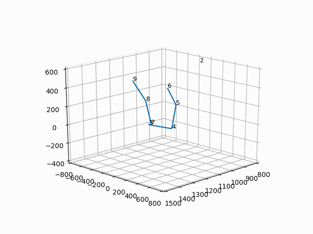
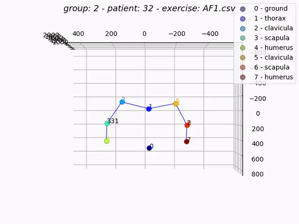
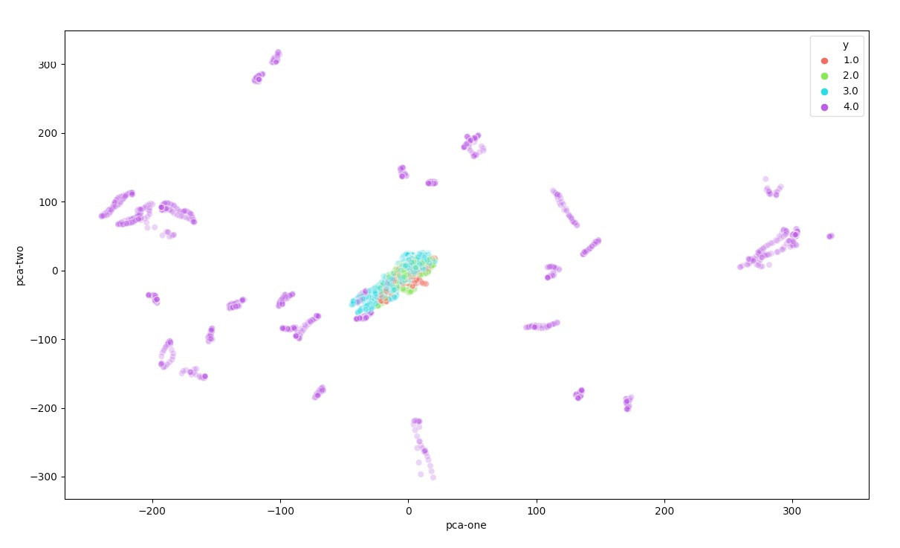
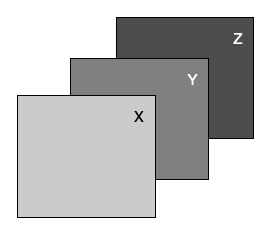
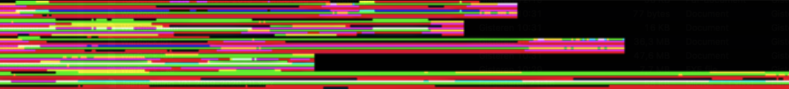
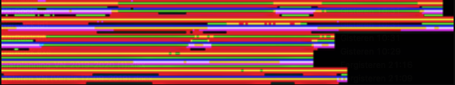
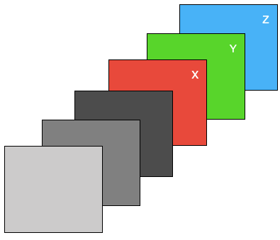

# Applied DataScience - Ortho Eyes
### Cooperation between LUMC Laboratorium of Kinematics en Neuromechanics (LK&N) and The Hague University of Applied Sciences. 

| # | Chapter | Paragraph | Description |
| --- | --- | --- | --- |
| 1. | [Research](#1-Research) | 
| 1.1 | | [Previous Groups](#11-Previous-groups) | 
| 1.2 | | [Project Management](#12-Project-Management) | 


# 1. Research

### Context
We are doing research for the LUMC in a collaboration with the Laboratory of Kinematics and Neuromechanics (LK&N). The LUMC has requested known patient for muscle torment for a special medical recording to the hospital. The patients are pre-selected by specialized physicians in different levels of torment. Every patient was seated into a special recording room where a physician attached multiple sensors from the Flock of Birds (FOB) recording system on bones of the patient. The patient did multiple types of exercises in most cases multiple times. 

### Data
This leaves us with a data-set of labeled kinematic patient recordings. The labels are created an put on the data by the LUMC physicians and based upon the type of exercise and the amount of torment in the muscles. 

### Research
Our research is about using machine learning techniques to classify feature patients based on the previous classification of the LUMC physicians. 

#### Research question 
> **To what extend and in what way, can different (unsupervised) data science techniques be used on kinematic recordings to contribute to a more valid and more reliable diagnosis, made by a doctor, on shoulder disability.**

#### Subquestions

# 1.1 Previous groups 
The projectgroup of 19/20 is not the first group who contributed to this research. The previous research group that took an interest in this subject has done allot of work to get us started quickly. [https://github.com/Lukelumia/Applied-Data-Science](https://github.com/Lukelumia/Applied-Data-Science). They mainly did research to determent what type of machine learning model would fit the data-set produced by the LUMC the best. They created a way to visualize the data and figure out what parts of the exercise are possibly leading to worse classification of the data. They also created an approach to increase the data-set. 

After reading their full reports the 19/20 project group had some doubts about certain assumptions the group made. Based on this information we contacted the LUMC for clarification. This led to the LUMC sharing more labels on our data-set in order to take some doubts / possible assumptions about the labels of the data-set from the previous group away. This still leaves allot of information to processes, and domain knowledge to gain. The verification of their process took almost the full time of the minor. 

# 1.2 Project Management
For our research we had to use SCRUM. This approach is not commonly used for research projects. However in our project group it worked good. After a few weeks reading / understanding the work of the previous group we were able sub questions (issues) building up to a main question. Each issue was built upon multiple tasks that were shared over the project group. All of this was implemented in Azure Dev Ops.  

# 2. Data-set
Physicians requested patients back in 4 groups. 
Each patient was requested to do multiple exercises: 

| Short | Description |
| --- | --- |
| AB[nr.] | Abduction |
| AF[nr.] | Anteflexion |
| RF[nr.] | Retroflexion |
| EH[nr.] | Endo/Exorotation coronal |
| EL[nr.] | Endo/Exorotation humerus |

Every recording was done with the FoB (Flock of Birds) system. 


This system uses sensors attached to the skin of a patient to record the exact location of a bone using electromagnetic fields. For each recording moment of a single sensor the FoB system stores a 3D matrix with the 3D position relative to the ‘black box’ that creates the electromagnetic fields. This 3D position is saved in plain text as a euler angle / rotation matrix. 

_AB1.txt_
```
    2  857.25  -41.08 574.18    // sensorid | x y z
         0.84   -0.54   0.01    // euler rotation matrix
         0.54    0.84   0.06    // euler rotation matrix
        -0.04   -0.04   1.00    // euler rotation matrix
```  

The LUMC created a script that was able to determent the exact position of a bone based upon the sensor location placed on the skin of a patient. 

The ‘raw data’ contains the position in a 3D space for a single bone. This could not be used 1:1 for machine learning. Different examples of why this could be an issue are: 
- Length of limbs could be read by the machine learning model.
- No certainty that every recording environment produces the same 3D space.  

To tackle these issues the LUMC implemented the script to calculate the rotation angle between bones. This would mean movements would be preserved, but the recording environment / bone lengths do not have influence anymore. 

The limbs of a human body are mirrored. So we use the same latin names for each bone and define the side by adding it into the name ```_l_``` or ```_r_```. Each bone is represented by 3 axis to define its rotation in space defined as euler angles. This data is stored as a simple .csv file format. Values are represented as floating point values. 

_Thorax is mirrored (data represented a single sensor)._
_Bones recored by FoB:_
- thorax
- clavicula
- scapula
- humerus
- elbowangle


_example patient exercise format (.csv):_
```
   thorax_r_x_ext  thorax_r_y_ax  thorax_r_z_lat  clavicula_r_y_pro  clavicula_r_z_ele  ...  humerus_l_z_ele  humerus_l_y_ax  elbowangle_l  28  29
0        6.485206      -4.220661       -1.233433          -15.00546           10.47724  ...         14.79337        46.02733        399.8214   0   0
1        6.485206      -4.220661       -1.233433          -15.44328           10.46473  ...         14.77317        45.71592        399.3666   0   0
2        6.485206      -4.220661       -1.233433          -15.42001           10.48047  ...         14.76965        45.32890        399.4807   0   0 
```

As being said we have 4 patient groups. Each patient did multiple exercises. The following folder structure is used through the whole project: 

_Project file tree, summarized :_
```
.
├── Category_1
│   ├── 1
│   │   ├── AB1.csv 
│   │   ├── AF1.txt
│   │   ├── AF2.csv
│   │   ├── AF2.txt
│   │   └── ...
│   ├── 2
│   │   ├── AB1.csv
│   │   ├── AB1.txt 
│   │   ├── AF2.csv
│   │   ├── AF2.txt
│   │   └── ...
│   └── ...
├── Category_2
│   ├── 1
│   │   ├── AB1.csv
│   │   ├── AB1.txt
│   │   └── ...
│   └── ...
├── Category_3
│   ├── 1
│   │   ├── AB1.csv
│   │   ├── AB1.txt
│   │   └── ...
│   └── ...
├── Category_4
│   ├── 1
│   │   ├── AB1.csv
│   │   ├── AB1.txt
│   │   └── ...
│   └── ...
```

Throughout the project reading the dataset very pretty easy. Using pandas we were able to load in the csv with `.read_csv()`. We attached numbers to the columns in order to replace those with the representing bone name.
 
# 3. Visualisation
For the project group it was the first few weeks hard to understand what data we could work with. In order to get insights into the data for our own understanding, as for the verification / data cleaning I created multiple scripts that were able to read the data an visualize it in different ways. 


# 3.1 Visualising raw data
I have created a class that was able to visualise raw data (before convertion to relative euler angels). [Link to full explanation of raw data](/TechincalDocumentation.md#31-Visualising-raw-data)

I first created a skeleton of each of the bones in 3D environment. 


After this i started putting this code in a animation based on matplotlib. 


I added some trajectory lines and more details to the animation to be more clear of what is being visualised. 


[repository for the first part of the code](https://dev.azure.com/DataScienceMinor/_git/Data%20Science?path=%2F&version=GBRaw-visualisation&_a=contents)

Because of the animation I created, we as a group were able to determined that the elbow angle is so far off a regular angle that we have skip these in future datasets. 

The number that is shown in the visualisation is the original elbow angle `% 360` witch still results in a too wide of range values to represent a normal angle. 
 
# 3.3 Data exploration
I have created a file that was able to visualise the data of all catagory's in one plot by using t-SNE. [Link to full explanation of t-SNE](/TechincalDocumentation.md#33-t-SNE)


### Results using category 1-3: 
_t-SNE AB1 Thorax_


Seen from the images is clear that different groups are present in the data. There are some outliners in a couple catagory's but nothing special. At the moment of creating these images there was not much data-cleaning done (for example removing double exercises and detecting anomolies.)

Also catagory 4 is missing from the dataset in the visualisations. Known was that the recordings from catagory 4 were not converted from raw to euler rotations correctly. This was clearly visible on the following visualisation. 
The small center in the middle is a zoomed out version of the first two images. We expected the data from catagory 4 to be somewhat comparable to catagory 1-3 but this result shows otherwise. 

### Results using category 1-3 + 4 
_t-SNE AB1 catagory 4_


# 3.4 Data preparation

1. Because of Data exploration I found the issue with the conversion of catagory 4. Based upon this visualisation the project group choose to remove this outlier until verification that the data is converted correctly.

2. As mentioned above the elbow angles are outliners. They don't fit into the expected values for the dataset. Because of the visualisation I created the the elbow angle is skipped. 

# 3.5 Combining raw + converted data

One of the ideas that was always present is to combine the information from rawdata with the converted data. The converded data was only readable by visualsing the plots. However this was hard for us to understand. With the data from the LUMC we were able to combine these two data-sets in one visualisation. With a group partner i have attempted to read both raw / converted values into a matplotlib visualisation to get the best understanding of the data-set that we have. 


# 4.1 Combining exercises

Patient data is devided in 5 main exercises (table 1). Physician’s recorded one or more exercises each category from a single patient. 

| Short | Description | Recording 1 | Recording 2 |
| --- | --- | --- | --- |
| AB[nr.] | Abduction | _AB1_ | __AB2__ |
| AF[nr.] | Anteflexion | _AF1_ | __AF2__ |
| RF[nr.] | Retroflexion |  _EH1_ | __EH2__ |
| EH[nr.] | Endo/Exorotation coronal | _EL1_ | __EL2__ |
| EL[nr.] | Endo/Exorotation humerus | _RF1_ | __RF2__ |

The goal is to train a logistics regression model with a combination of all exercise types.
To do this we have to solve a time / exercise length problem. Exercises when executed by patients almost never have the same length. A logistics regression model expects the same amount of inputs for every entry in the dataset. We solved this by creating a combination of exercises with a fixed length. 

Timing issue 
From each exercise we have picked n frames (smaller than the smallest exercise in the whole dataset). We stepped through the exercise with a step size of exercise-length / n. This simple approach leaves us with a static number of frames for each exercise. 


In the case of an exercise with 10 frames, we can pick 5 frames from the exercise: 10 / 5 = 2. We pick the following frames from the exercise: 

Creating a single patient 
As said above we have 5 exercise types for each patient. We appended these combinations together in order to create a single row in our dataset. 

| [n frames] | [n frames] | [n frames] | [n frames] | [n frames] |
| --- | --- | --- | --- | --- |
| AB1 | AF1 | EH1 | EL1 | RF1 | 

In order to maximize the training dataset, we used a combination of exercise types from a single patient. 

|Combination # | [n frames] | [n frames]  | [n frames] | [n frames] | [n frames] |
| --- | --- | --- | --- | --- | --- |
|1| AB1 | AF1 | EH1 | EL1 | RF1 |
|2| __AB2__ | AF1 | EH1 | EL1 | RF1 | 
|3| AB1 | __AF2__ | EH1 | EL1 | RF1 | 
|4| AB1 | AF1 | __EH2__ | EL1 | RF1 |
|5| AB1 | AF1 | EH1 | __EL2__ | RF1 |
|6| AB1 | AF1 | EH1 | EL1 | __RF2__ |


In the case of 5 frames per exercise, 5 exercise types per patient, 26 features per exercise = 650 features for a single patient exercise combination. 

The a mount of combinations for a single patient =  
[n AB recordings] · [n AF recordings] · [n EH recordings] · [n EL recordings] · [n RF recordings]


# 4.2 Extracting more exercises
In the case of an exercise with 10 frames, we can pick 5 frames from the exercise: 10 / 2 = 5. We pick the following frames from the exercise: 

||||||&darr;|||||&darr;|
| --- | --- | --- | --- | --- | --- | --- | --- | --- | --- | --- |
| Frame index: | 1 | 2 | 3 | 4 | __5__ | 6 | 7 | 8 | 9 | __10__ |

However this would leave us with unused parts of the exercise. In order to still use all the data for training we created a new method that looks before and after the selected frame (if possible) and extracts these as a new formatted exercise. In the example case its only possible to look before values, this leaves us with two exercise extractions: 

|||||__&darr;__|&darr;||||__&darr;__|&darr;|
| --- | --- | --- | --- | --- | --- | --- | --- | --- | --- | --- |
| Frame index: | 1 | 2 | 3 | __4__ | _5_ | 6 | 7 | 8 | __9__ | _10_ |

This method would leave us with more data, and we did not use the same data twice. Since the data consists of movements the values almost always fluctuates. 

Generating the frames is done on exercise level. Doing this won't affact the relation between the patient group and the patient. This allows us to use the same methology as above. Looping again trough patients to find all combinations between exercises for a single patient. 


# 4.4 Images (pictures) from exercises 

Images are a great way of formatting data. A single pixel could consist out of 3 channels (colors: red, green, blue) with defined values (0 -> 255). Or data-set consists out of sensors placed on a patient. These sensors record in 3 dimentions (x, y, z). A good fit for the 3 channels in an image. 



There are pretrained neural networks based upon recignising patterns in images. Fitting our data into could introduce these pretrained networks for our model. 

To start with I have made a list of bones i want to attach to each row of pixels. For each moment in time a pixel is created with 3 channels. Stacking the pixels next to each other to create a single row. 

| row index | channel 1 | channel 2 | channel 3 |
| --- | --- | --- | --- |
|1| thorax_r_x_ext | thorax_r_y_ax | thorax_r_z_lat | 
|2| clavicula_r_y_pro | clavicula_r_z_ele | clavicula_r_x_ax |
|3| scapula_r_y_pro | scapula_r_z_lat | scapula_r_x_tilt |
|4| humerus_r_y_plane | humerus_r_z_ele | humerus_r_y_ax |
|5| thorax_l_x_ext | thorax_l_y_ax | thorax_l_z_lat |
|6| clavicula_l_y_pro | clavicula_l_z_ele | clavicula_l_x_ax |
|7| scapula_l_y_pro | scapula_l_z_lat | scapula_l_x_tilt |
|8| humerus_l_y_plane | humerus_l_z_ele | humerus_l_y_ax| )

This process results in a bar of 8 pixels. A patient has done 5 exercises, stacking these exercises in a zeroed out array creates the following image

_Patient converted into image, enlarged_ -> [original](images/patientimage1.png)



_Patient converted into image, enlarged_ -> [original](images/patientimage2.png)


For the first image its clear that the last exercise added (lowest bar with color green present) has a much longer lenght than the other exercises. The colors do not appear to change much over time. But looking at the actual pixel values there is much variation in it. This is probably because of image viewers / screen quality fewing a small image of 8 * 5 pixels. 

Creating the image for a single patient. To define the color of the pixel i normalized the values of each bone axis to a value between 0 and 1. 
All values in the exercise recordings are euler angles. By using modulo 360 the values are converted to [0-360]. By deviding these results by 360 we get values between [0-1]. By multiplying these values by 255 we get the  pixel values [0-255].

## adding additional layers to the image 
Most images on the web are based upon 3 channels; red green blue. Additional channels are sometimes used for transparacy or other values. In our case a pretrained neural network can take unlimited amount of channels and still interpretate the values together as a image. This means we can add more information to the image. 

**differentiation** 

Requested from the LUMC is the differentiation between values. In order to keep the differentiation values attached to the representing bone axis we can stack the values in the new channels. 

For each of the bone axis we can calculate the difference between values. This means from one bone we get a difference in x y z. This would result in 3 additional layers



We pass the signal through a lowpass filter in order to get an clean result. Based upon these values we can derive the difference and add this to the pixels the same way as we did above. 


## 5. Machine Learning 

### Logistic Regression 

Our data contains movement of a patient. From this movement we want to determen the catagory this patient is in. This is called a classification problem. There a many models to solve classification. Based on the previous groups research we have selected Logistic regression. [They have done extensive research to the differences between models on our dataset.](https://github.com/Lukelumia/Applied-Data-Science). However we have implemented other machine learning techniques in the codebase. These results were very bad and not comparable to logistic regression. 
 

| Model | Accuracy | MCC | LogLoss | RSME | RMSLE |
| --- | --- | --- | --- | --- | --- |
|Logistic Regression|0.690173|0.584366|1.47405|0.556621|0.163916|
|KMeans|0.720231|0.060499|-------|0.905985|0.392598|

### Configuring a Model
| hyperparameter | selected option | Description | refrence
| --- | --- | --- | --- | --- |  
| solver | lbfgs | The default solver of sklearn. Perserves memory by remembering the last iterations to improve gradient descent | [refrence](https://towardsdatascience.com/dont-sweat-the-solver-stuff-aea7cddc3451) |
| max_iter | 2000 | Capping the maximum amount of iterations. This to prevent the model running for too long, since we tested with multiple models this helped us to faster test different configurations. |
| multi_class | auto | Using sklearns default setting |

### Training a model

When training the model with single instances of a patient, the results were always very low. This is most likely because of underfitting. [A solution to underfitting is the creation of extra frames for each patient](#41-Combining-exercises). 

I have not found other proceedings we could have taken to increase the datasize. Lowering the amount of test records did not feel like a sensible solution. 

### Evaluating a model

For model evaluation I have implemented a test / train set for the training. The evaluation of the test test is what defines the accuracy over the whole model. This prevents the model from overfitting, otherwise the combined result (accuracy) would have been very low. 

The creation of the test set also applies to full patients instead of single exercise combinations. This MUST be done since we combine different parts of combinations. Exercises are combined to create a large amount of combinations. This means if we do not split the train / test set on patient level a part of the exercise could already be known / learned to the model. 

[To implement this feature we have created a list of patient id's who have been 'randomly' selected to be part of the test group. **Link to github commit**](https://dev.azure.com/DataScienceMinor/Data%20Science/_git/Data%20Science/commit/326c50dbd7da01f6264818c96b60d38a8dee6d07)

Next to this we have added multiple values to check the evaluation of the model, see the table in **Configuring a Model**

### Visualizing the outcome of a model (explanatory)

We have created a table to output the results of the model. This makes it easy to compare values over different configurations. 
   
```
  Accuracy       MCC    LogLoss      RSME     RMSLE  remove_idle    frame_generator      frame_generator_count    column_index    frames_counts  normalise      remove_idle_split_count  resample_exercise    default
----------  --------  ---------  --------  --------  -------------  -----------------  -----------------------  --------------  ---------------  -----------  -------------------------  -------------------  ---------
  0.684393  0.59692     3.29152  0.564867  0.163033  False          False                                    7               1                5  False                                3  False                False
  0.684393  0.59692     3.29152  0.564867  0.163033  False          False                                    7               1                5  False                                5  False                False
  0.684393  0.59692     3.29152  0.564867  0.163033  False          False                                    7               1                5  False                                5  False                True
  0.686705  0.574977    1.4705   0.559727  0.165931  True           False                                    7               1               15  True                                 5  False                True
  0.687861  0.598815    3.26682  0.561789  0.16215   False          False                                    7               0                5  False                                3  False                False
```


# 13. Future of the project
## Argumented Reality 
Mobile bodytracking is possible by using Apple's [ARKit](https://developer.apple.com/augmented-reality/arkit/): 
Apple presented a example for their developers on WWDC where they are [bringing people into AR](https://developer.apple.com/videos/play/wwdc2019/607). Implementing this project in wide scale available devices such as the iPhone make the work accesable for normal people. It could also provide large data-sets for physician and datascientist to do research on. Results could also be stored privatly in [HealthKit](https://developer.apple.com/healthkit/)

>
>[_picture from Laurent Brusa - Introducing-ARKit3_](https://multitudes.github.io/2019/07/Introducing-ARKit3.html)

>
>[_picture from Laurent Brusa - Introducing-ARKit3_](https://multitudes.github.io/2019/07/Introducing-ARKit3.html)

## Neural Networks
Seeing the power and the avaiablility of high quality pretrained networks i would really like to see what a model could find in a result. 

### Understanding Neural Network Descisions 
If in the feature a research group would be able to create a high functioning neural network. The descisions of the neural network would be really interesting for physician's. Understanding what the difference is in the data-set could help them: 
- Verify their current methodolgy is correct, and works like expected
- Develop new methods to investigate a patient for the disease

There are already developed technology's to get information from a neural network.

>
>[https://towardsdatascience.com/understanding-your-convolution-network-with-visualizations-a4883441533b](https://towardsdatascience.com/understanding-your-convolution-network-with-visualizations-a4883441533b)

>
>[https://mc.ai/learning-how-ai-makes-decisions/](https://mc.ai/learning-how-ai-makes-decisions/)

# 9. Personal Development 
## Datacamp

- [Cleaning Data in Python](/datacamp/)
- [Importing Data in Python (Part 1)](/datacamp/)
- [Introduction to Data Visualization in Python](/datacamp/)
- [Python Data Science Toolbox (Part 1)](/datacamp/)
- [Python Data Science Toolbox (Part 2)](/datacamp/)
- [Statistical Thinking in Python (Part 1)](/datacamp/)
- [Pandas Foundations](/datacamp/)

## Udemy 
- [Deep Learning with TensorFlow 2.0](https://www.udemy.com/course/machine-learning-with-tensorflow-for-business-intelligence/)

# 14. Scrum Tasks
- Tasks were not always assniged to a name. 
- Tasks were not always written down in DevOps

|||||||||
| --- | --- | --- | --- | --- |  --- |  --- | --- |
|ID|Work Item Type|Title|State|Area Path|Tags|Comment Count|Changed Date
|178|Task|Data: Combinations|Done|Data Science| |0|7-1-2020 14:06
|77|Task|Read through code of Matlab to see if new information could be added to csv (entropy etc)|Done|Data Science| |0|7-1-2020 13:01
|73|Task|Convert raw patient data to CSV with Matlab|Done|Data Science| |0|7-1-2020 12:55
|151|Task|Running all configs with different ml models|Doing|Data Science| |0|16-12-2019 13:41
|133|Task|Detect abnormal movement|Doing|Data Science| |0|16-12-2019 13:40
|24|Task|Read Paper|Done|Data Science| |0|16-12-2019 13:17
|51|Issue|Split all the data in a new trainset and a testset|Done|Data Science| |1|16-12-2019 13:13
|109|Task|I want to give a personal presentation about the global steps of the project / overfitting / how i solved some of my coding issues|Done|Data Science| |0|16-12-2019 12:40
|38|Issue|As a student I need to understand the basic steps the last group took|Done|Data Science| |0|16-12-2019 12:38
|149|Task|Creating configurations [based upon reached goals]|Done|Data Science| |0|2-12-2019 10:24
|145|Task|ConfigLoader|Done|Data Science| |0|25-11-2019 09:57
|137|Task|Generate more data from one exercise|Done|Data Science| |0|5-11-2019 10:28
|52|Issue|Redo the analysis from last year with the new split dataset|Done|Data Science| |0|11-10-2019 10:40
|78|Task|Converting the exercise data from Brice / Lennart / Rapahel to CSV|Doing|Data Science| |0|11-10-2019 10:20
|76|Task|Downloading course for Deep Neural Networks|Done|Data Science| |0|11-10-2019 10:19
|42|Task|Compare ml results with and without normalized data.|Done|Data Science| |1|30-9-2019 13:01
|30|Task|Comparing [super cleaned data] vs [normal data] in 2d visualisations|Done|Data Science| |0|30-9-2019 10:21
|40|Task|Use the created visualisation tool to verify the cleaned data|Done|Data Science| |1|30-9-2019 10:21
|39|Task|Create tool to visualize the cleaned data|Done|Data Science| |0|30-9-2019 10:18
|28|Task|Create animated visualisation of Raw data file|Done|Data Science| |0|16-9-2019 09:10
|15|Task|Eddie|Done|Data Science| |0|6-9-2019 09:48
 
# 15. Git Commits


[Git Commits.md](/Gitcommits.md) 